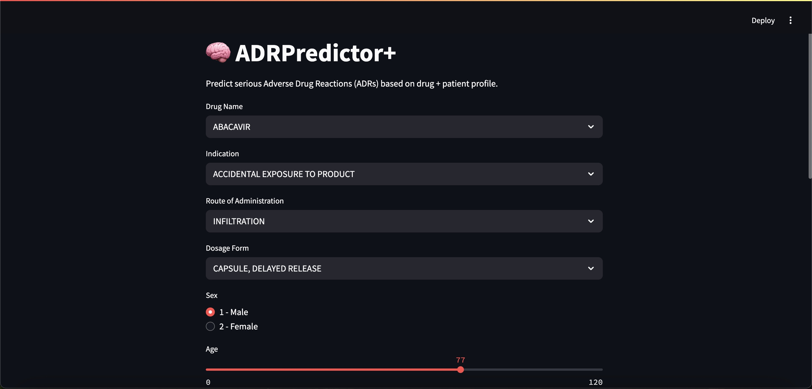
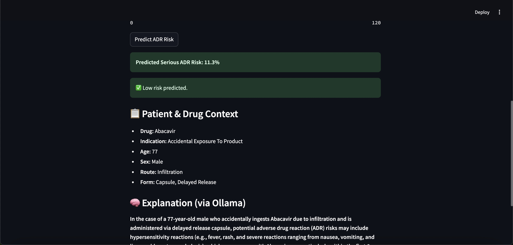

# 🧠 ADRPredictor – Adverse Drug Reaction Risk Analyzer

ADRPredictor is a lightweight, real-time app that predicts the likelihood of serious adverse drug reactions (ADRs) based on patient data and drug characteristics — built using real FAERS pharmacovigilance data and powered by local LLM explanations.

<p align="center">
  
  <br/>
  <em>🔍 Input form: Fill in patient and drug profile to assess ADR risk</em>
</p>

<p align="center">
  
  <br/>
  <em>🧠 Output: Model prediction with LLM-based explanation of risk</em>
</p>

---

## ⚡ Features

- Predicts **serious ADR risk** from drug, age, sex, route, indication, and dosage form
- Uses a trained machine learning model (RandomForest) on a flattened FAERS dataset
- Provides **natural language risk explanations** powered by local LLM (via Ollama + Mistral)
- Runs completely offline — no cloud APIs, no keys
- Clean and fast UI built with **Streamlit**
- Fully open-source and reproducible

## 📦 Tech Stack

- Python, Streamlit
- scikit-learn, SHAP, pandas
- Ollama (for local LLM inference)
- FAERS JSON dataset flattened to CSV for model training

## 🚀 How to Run Locally

1. **Clone the repo**  
   ```bash
   git clone https://github.com/rohanreddy1201/adrpredictor.git
   cd adrpredictor
   ```

2. **(Optional) Set up Python**  
   Use `pyenv`, conda, or system Python (`>=3.9` recommended).

3. **Install dependencies**  
   ```bash
   pip install -r requirements.txt
   ```

4. **Start Ollama LLM backend** (for explanations)
   ```bash
   brew install ollama
   ollama serve
   ollama pull mistral
   ```

5. **Run the app**
   ```bash
   streamlit run app/main.py
   ```

> ✅ Your browser will open to `http://localhost:8501`

---

## 🧠 Example Input

```text
Drug: Abacavir
Indication: Accidental Exposure
Age: 50
Sex: Male
Route: Infiltration
Dosage Form: Capsule, Delayed Release
```

---

## 📊 Output

- A **risk score** (0–100%) of serious ADRs
- A **generated explanation** using medical language from local LLM
- Feature contributions and SHAP insights

---

## 🧪 Dataset

- Based on real **FAERS structured JSON** drug-event data
- Preprocessed and flattened to `app/data/flattened_faers.csv`

---

## 🧠 LLM Explanation

- Powered by [Ollama](https://ollama.com) with the **Mistral** model
- No external API calls, no latency
- Context-aware risk descriptions based on inputs

---

## 🛠 Project Structure

```
adrpredictor/
├── app/
│   ├── main.py                  # Streamlit app entry
│   ├── model/                   # ML model + ollama explanation
│   ├── utils/                   # Input config, LLM, helpers
│   └── data/                    # Processed FAERS dataset
│   └── docs/                    # Screenshots for README
├── requirements.txt
└── README.md
```

---

## 📌 Author

**Rohan Reddy**  
AI Cloud Engineer · [LinkedIn](https://www.linkedin.com/in/roreddy/)  
[Portfolio](https://rohanreddy1201.github.io)

---

## 🧩 License

MIT License
